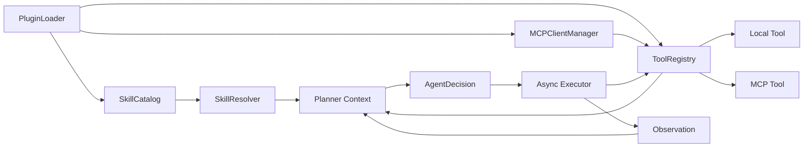

# Skills、Plugins 与 MCP 接入设计

日期：2026-08-08

状态：已确认设计，等待书面规格复核

## 1. 背景

`minimal-agent` 当前已经具备以下基础能力：

- `Planner` 将用户输入转换为步骤；
- `Executor` 执行步骤；
- `ToolRegistry` 注册和发现本地工具；
- OpenAI、Gemini 和 Mock LLM 适配器；
- 同步请求、后台队列以及 SQLite 工作流恢复；
- API Key 鉴权、HTTP 工具边界、审计和 Prometheus 指标。

现有执行协议以自由文本步骤和正则工具名识别为主。这种协议不能可靠承载 MCP 的 JSON Schema、权限、调用状态和副作用语义；现有的一次规划、按表执行模式也无法把工具结果交回模型继续决策。

本设计在保留现有入口兼容性的前提下，为项目增加原生的 Skill、Plugin 和 MCP 能力运行时，并从根上升级工具调用与动态 Agent 执行协议。

## 2. 目标

1. 提供项目自有的轻量插件格式，不要求兼容 Codex 插件格式。
2. 支持声明式 Skill：指令和参考资料默认不可执行。
3. 使用官方 MCP Python SDK 接入本地 `stdio` 和远程 Streamable HTTP Server。
4. 将本地工具和 MCP 工具统一为结构化、可校验、可审计的能力协议。
5. 通过有界 Plan-Act-Observe 循环，让模型能够根据工具结果继续决策。
6. 为有副作用工具定义明确的重试、崩溃恢复和未知结果语义。
7. 采用渐进迁移，保留现有字符串步骤和固定工作流入口一段兼容期。

## 3. 非目标

- 首版不支持运行时上传、下载、安装或热加载插件。
- 首版不提供插件市场和依赖自动安装。
- 首版不支持旧版 MCP SSE transport。
- 首版不允许 Skill 直接运行脚本。
- 首版不提供通用 Python 插件 `entrypoint` 或动态导入机制。
- 首版只提供部署级工具 allowlist，不实现完整的用户级 RBAC。
- 首版不并行调度多个有副作用工具调用。
- 不自行实现 MCP 协议、transport、会话或 JSON-RPC。

## 4. 已选方案

采用“统一能力运行时 + MCP 适配层”。Plugin 是声明和分发容器，Skill 是上下文与流程层，MCP 是外部工具通信层。所有可执行能力最终进入统一的 Tool Registry。



未选择的方案：

- “所有能力都包装成 MCP”会让简单本地函数也承担进程和协议成本，并不能自然解决 Skill 选择。
- “Python 插件动态导入”实现快，但会赋予插件任意代码执行权限，与声明式安全边界冲突。

## 5. 模块划分

新增模块：

```text
src/agent/capabilities/
  models.py          # ToolSpec、ToolCall、ToolResult、AgentDecision
  registry.py        # 统一的同步/异步工具注册与调用

src/agent/plugins/
  models.py          # plugin.yaml 的 Pydantic 模型
  loader.py          # 扫描、校验和加载本地插件

src/agent/skills/
  models.py          # Skill 元数据
  loader.py          # 安全读取 SKILL.md 和 references
  resolver.py        # 显式选择与确定性触发匹配

src/agent/mcp/
  config.py          # stdio/Streamable HTTP 配置模型
  manager.py         # MCP Client 生命周期与工具发现
  adapter.py         # MCP Tool 与项目 ToolSpec/ToolResult 转换

src/agent/runtime/
  context.py         # Planner 上下文和预算
  runner.py          # 有界 Plan-Act-Observe 循环
  run_store.py       # 动态运行、决策和工具调用持久化
```

现有模块调整：

- `planner.py` 组装系统指令、Skill、工具 schema、Observation 和预算。
- `llm.py` 的核心契约从 `plan(prompt)` 演进为 `decide(context) -> AgentDecision`。
- `executor.py` 执行结构化 ToolCall，不通过正则猜测 MCP 参数。
- `server.py` 使用 FastAPI lifespan 管理插件和 MCP 会话生命周期。
- `task_queue.py` 增加动态 AgentRun 的队列入口；原固定 Workflow 保留。
- `tool_registry.py` 在兼容期委托给新的 capability registry。

每个模块只承担一个边界：Plugin Loader 不执行工具，Skill Resolver 不连接 MCP，MCP Adapter 不决定权限，Executor 不解析自由文本计划。

## 6. 插件格式与安装模型

插件只能由部署管理员放入配置的插件根目录。服务启动时扫描、校验和加载，配置变更后重启生效。

```text
plugins/
  github-tools/
    plugin.yaml
    skills/
      review-pr/
        SKILL.md
        references/
    mcp/
      optional-local-server-files
```

示例清单：

```yaml
api_version: minimal-agent/v1
id: github-tools
version: 1.0.0
enabled: true
required: false

skills:
  - id: review-pr
    path: skills/review-pr/SKILL.md
    triggers:
      - review pull request
      - 检查 PR

mcp_servers:
  - id: github
    transport: streamable_http
    url_env: GITHUB_MCP_URL
    headers_env:
      Authorization: GITHUB_MCP_AUTH
    allowed_tools:
      - name: search_issues
        side_effects: false
        idempotent: true
      - name: get_pull_request
        side_effects: false
        idempotent: true
```

清单规则：

- 使用成熟 YAML 库解析，随后由 Pydantic 严格校验；未知字段默认拒绝。
- `api_version` 必须等于当前支持版本。
- `required` 默认是 `false`。
- Plugin、Skill 和 MCP ID 使用受限字符集，并在各自作用域唯一。
- 所有相对路径解析后必须仍位于插件根目录内；拒绝符号链接或 junction 逃逸。
- 密钥只通过环境变量引用，不能把密钥值写入清单。
- MCP 工具全名为 `<plugin-id>.<mcp-id>.<tool-name>`。
- MCP Server 发现但未列入 `allowed_tools` 的工具不注册。
- `allowed_tools` 的每个条目必须显式声明 `side_effects` 和 `idempotent`；缺失或发现不到已声明工具时，该插件初始化失败。
- 运行时 Capability Catalog 是只读快照，不做热变更。

## 7. Skill 模型与选择

Skill 首版是声明式能力，包含：

- `SKILL.md`：适用场景、指令和流程；
- `references/`：按需读取的补充资料。

Skill 不能直接执行脚本。需要副作用时只能调用当前运行已授权的本地工具或 MCP 工具。

选择顺序：

1. 请求中的 `skill_ids` 显式指定；
2. 插件清单中的确定性 `triggers` 匹配；
3. 没有匹配时仅使用基础 Planner。

Skill 对外 ID 为 `<plugin-id>.<skill-id>`，避免跨插件冲突。首版不增加第二次 LLM 调用进行 Skill 路由。Resolver 对输入和触发词执行 Unicode case-fold、首尾裁剪和连续空白合并，然后按完整触发短语包含匹配；按 Plugin 和 Skill ID 稳定排序，在达到最大激活数量后停止，避免上下文无限增长。

只有已激活 Skill 的 `SKILL.md` 会进入 Planner 上下文。`references/` 不整体注入；内置只读工具 `skill_read_reference` 只能读取当前已激活 Skill 根目录下的 UTF-8 普通文件，并执行路径和大小校验。

## 8. MCP 接入

实现依赖官方 MCP Python SDK v2。实施时选择并精确锁定一个经过项目测试的 v2 版本；不自行实现协议或 transport。

支持：

- `stdio`：Host 启动本地 MCP 子进程；
- Streamable HTTP：连接部署的 MCP Server。

不支持：

- 旧 SSE transport；
- 插件自定义 transport；
- 未经清单允许的动态工具。

启动加载过程：

1. 按稳定顺序扫描插件目录。
2. 校验所有插件清单及路径。
3. 建立 SkillCatalog。
4. 创建 MCP Client，初始化会话并发现工具。
5. 将 allowlist 中的 MCP schema 转换为 ToolSpec。
6. 检查全名冲突后注册工具。
7. 发布只读 Capability Catalog。

`required: true` 的插件初始化失败会阻止服务启动；`required: false` 的插件只会被禁用，其他能力继续运行。

## 9. 统一能力协议

`ToolSpec` 至少包含：

```text
name
description
input_schema
source
plugin_id
timeout_seconds
side_effects
idempotent
result_size_limit
```

模型每轮只能返回两种决策之一。

工具调用：

```json
{
  "type": "tool_calls",
  "calls": [
    {
      "call_id": "call_01",
      "tool": "github-tools.github.search_issues",
      "arguments": {"query": "is:open bug"}
    }
  ]
}
```

最终回答：

```json
{
  "type": "final",
  "answer": "发现 3 个未关闭问题。"
}
```

主要数据模型：

```text
AgentRun
  run_id
  owner_id
  prompt
  selected_skills
  status
  current_round
  limits
  final_answer

AgentDecision
  type: tool_calls | final
  calls | answer

ToolCall
  call_id
  tool
  arguments

ToolResult
  call_id
  status: success | error | unknown_outcome
  content
  error_code
  retryable
```

Tool Registry 提供异步调用接口，并允许通过适配器注册现有同步本地工具。CLI 和旧测试可以使用受控同步包装器，但异步服务路径不得在每次调用时临时创建嵌套事件循环。

## 10. 有界 Plan-Act-Observe 循环

新 Skill/MCP 入口使用以下循环：

1. Runtime 构建包含已激活 Skill、工具 schema、历史 Observation 和剩余预算的上下文。
2. LLM Adapter 返回一个结构化 AgentDecision。
3. Runtime 使用 Pydantic 校验决策。
4. `tool_calls` 由 Executor 逐个校验并执行。
5. ToolResult 作为明确标记的 `untrusted_observation` 返回模型。
6. 模型继续返回工具调用或 `final`。
7. 达到轮数、调用数或总时限后，Runtime 以稳定的预算耗尽状态终止。

默认限制：

- 最多 8 轮；
- 最多 20 次工具调用；
- 整次运行最多 60 秒。

这些限制由部署配置覆盖，但必须保持正数和全局上限。

LLM Adapter 优先使用对应后端可用的结构化输出能力；不支持时使用 JSON 解析、Pydantic 校验和最多一次格式修复。修复仍失败时终止本轮，绝不把猜测结果交给 Executor。

首版顺序执行同一决策内的多个工具调用。现有字符串步骤由 Legacy Plan Normalizer 转为无副作用的兼容步骤；兼容层不会为自由文本推断新的 MCP 参数。

## 11. 持久化与恢复

动态 Agent 运行使用独立的持久化模型，不把现有固定步骤 Workflow 表扩展成通用状态机。

新增逻辑表：

```text
agent_runs
agent_decisions
agent_tool_calls
```

恢复协议：

1. 工具调用前保存 ToolCall，状态为 `dispatching`。
2. 调用完成后保存 ToolResult。
3. 已持久化结果的调用不会重复执行。
4. `dispatching` 状态的幂等调用可按策略重新执行。
5. `dispatching` 状态的非幂等或未声明调用恢复为 `unknown_outcome`，运行进入 `needs_attention`。
6. 最终答案持久化后，AgentRun 才能标记为 `completed`。

连接初始化和工具发现可以重试。工具业务调用只有在 `idempotent: true` 时自动重试。对于已发送但结果未确认的副作用调用，系统不能声称“执行失败且没有产生效果”。

现有固定 WorkflowStore 和原队列语义保留，后续单独决定淘汰时间。

## 12. 安全模型

### 12.1 stdio

`stdio` MCP 会启动本地程序，等同于管理员授予代码执行权限，不能因为插件是声明式就把它视为无执行风险。

- `command` 和 `args` 分字段声明，不接受 shell 字符串。
- 禁止 `cmd /c`、PowerShell、`bash -c` 等 shell 包装器。
- 可执行文件必须匹配部署级 allowlist。
- 工作目录限制在插件目录或明确批准的目录。
- 子进程只继承显式允许的环境变量。
- 设置启动、调用和关闭超时，服务关闭时清理子进程。

### 12.2 Streamable HTTP

- 生产环境默认只允许 HTTPS。
- 使用 `AGENT_MCP_ALLOWED_HOSTS` 限制目标 Host。
- 禁止自动重定向，并执行 DNS 重绑定和私网地址防护。
- Header 值只能来自环境变量。
- 连接信息和密钥不得写入 API、日志或 SQLite。

### 12.3 工具与内容

- 所有参数按 ToolSpec 的 JSON Schema 校验。
- 未在 allowlist 中的工具默认拒绝。
- MCP 工具描述和返回内容都是不可信数据，不能覆盖 System 或 Skill 指令。
- 工具结果和 Skill reference 都有单项及运行级大小限制。
- 审计记录插件、Skill、工具名、耗时和状态，不记录完整敏感参数。
- 首版权限是部署级 allowlist；用户级 RBAC 作为后续独立设计。

## 13. API 与配置

保留现有接口并增量扩展：

```text
POST /api/handle
POST /api/handle/queue
GET  /api/tasks/{run_id}
GET  /api/tools
GET  /api/plugins
GET  /api/skills
```

`POST` 请求增加可选 `skill_ids`。未传时保持现有请求格式兼容。任务查询响应增加运行类型和动态 Agent 状态，但保留现有字段。

新增配置：

```text
AGENT_CAPABILITY_RUNTIME_ENABLED
AGENT_PLUGIN_DIR
AGENT_MCP_ALLOWED_HOSTS
AGENT_MCP_STDIO_ALLOWED_COMMANDS
AGENT_MAX_AGENT_ROUNDS
AGENT_MAX_TOOL_CALLS
AGENT_AGENT_TIMEOUT_SECONDS
AGENT_MAX_ACTIVE_SKILLS
AGENT_MAX_TOOL_RESULT_BYTES
AGENT_MAX_SKILL_REFERENCE_BYTES
```

新运行时首个发布版本默认关闭；显式开启并验证稳定后，再通过后续版本改为默认。

## 14. 可观测性

新增指标：

```text
agent_plugin_load_total
agent_mcp_connection_status
agent_tool_calls_total
agent_tool_call_duration_seconds
agent_tool_unknown_outcome_total
agent_run_rounds
agent_run_budget_exhausted_total
```

`GET /api/plugins` 返回插件启用状态、错误摘要和已注册能力；`GET /api/skills` 返回可用 Skill 元数据。两者均受现有鉴权保护，不返回密钥、原始 Header 或子进程环境。

日志和指标的标签不得包含 Prompt、工具参数、工具结果、密钥或其他高基数敏感内容。

## 15. 测试策略

### 15.1 单元测试

- 清单解析、版本校验、重复 ID 和路径越界；
- Skill 显式选择、触发匹配和 reference 范围；
- ToolSpec schema、命名空间和 allowlist；
- AgentDecision 解析、格式修复和非法输出拒绝；
- 轮数、工具次数、超时和大小限制；
- 幂等、非幂等及 `unknown_outcome` 状态转换。

### 15.2 MCP 契约测试

- 使用官方 SDK 的内存 Server 测试通用适配器；
- 使用本地假 Server 覆盖 `stdio` 和 Streamable HTTP；
- 覆盖初始化、发现、调用、超时、断线和关闭；
- 不连接真实 SaaS，不执行真实外部写操作。

### 15.3 端到端与恢复测试

- Plugin 加载到最终回答的完整链路；
- Fake LLM 控制每轮结构化决策；
- 模拟进程在调用前、调用中和结果保存后退出；
- 验证非幂等调用不会因恢复而重复执行；
- OpenAI 和 Gemini 使用 fake client 做结构化协议契约测试，不消耗真实模型额度。

### 15.4 安全测试

- 拒绝 shell 包装命令和未批准可执行文件；
- 拒绝插件目录外路径、链接逃逸和未允许的 MCP Host；
- 验证密钥不会出现在 API、日志或数据库中；
- 验证远程新增工具不会绕过 allowlist。

## 16. 实施分解

本设计按依赖关系拆成六个可独立验证的阶段：

1. Pydantic 能力协议、异步 Tool Registry 和旧接口兼容。
2. Plugin Loader、SkillCatalog、SkillResolver 和安全 reference 读取。
3. 官方 MCP SDK、两种 transport、生命周期与工具适配。
4. 有界 Plan-Act-Observe Runtime 和 LLM Adapter 新契约。
5. AgentRun 持久化、崩溃恢复和未知结果处理。
6. API、指标、Docker 配置、文档和端到端验证。

每一阶段必须通过自身测试和现有完整回归后才能进入下一阶段。实施计划应把这些阶段进一步拆成小提交，避免一次性替换现有运行时。

## 17. 验收标准

1. 管理员可通过本地插件目录声明 Skill 和 MCP Server。
2. 服务能通过官方 SDK 连接 `stdio` 与 Streamable HTTP MCP Server。
3. 只有 allowlist 中的 MCP 工具进入 Capability Catalog。
4. Planner 能基于显式 Skill 或确定性 trigger 生成合法结构化决策。
5. 工具结果能作为 Observation 驱动下一轮决策，并最终产生回答。
6. 运行严格遵守轮数、工具数、总时限和结果大小限制。
7. 非幂等调用在崩溃后的不确定状态不会被自动重复执行。
8. 插件、Skill、工具和运行状态可通过鉴权 API 与指标观察。
9. 密钥不出现在插件文件、API 响应、日志或 SQLite 中。
10. 原同步接口、旧字符串步骤和固定工作流测试继续通过。

## 18. 参考实现

- 官方 MCP Python SDK：https://github.com/modelcontextprotocol/python-sdk
- MCP Server transport 指南：https://github.com/modelcontextprotocol/python-sdk/blob/main/docs/run/index.md

官方 SDK 已提供客户端、Server、schema、会话生命周期以及标准 transport，本项目只实现适配、策略和业务运行时，不重复实现 MCP 协议栈。
